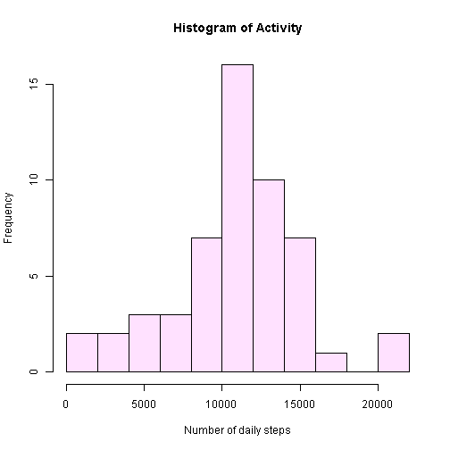

Reproducable Research Peer Assessment 1
========================================================

##Download the data 
You have to change https to http to get this to work in knitr


```r
target_url <- "http://d396qusza40orc.cloudfront.net/repdata%2Fdata%2Factivity.zip"
target_localfile = "ActivityMonitoringData.zip"
if (!file.exists(target_localfile)) {
  download.file(target_url, destfile = target_localfile) 
}
```

Unzip the file to the temporary directory

```r
unzip(target_localfile, exdir="extract", overwrite=TRUE)
```

List the extracted files

```r
list.files("./extract")
```

```
## [1] "activity.csv"
```

Load the extracted data into R

```r
activity.csv <- read.csv("./extract/activity.csv", header = TRUE)
activity1 <- activity.csv[complete.cases(activity.csv),]
str(activity1)
```

```
## 'data.frame':	15264 obs. of  3 variables:
##  $ steps   : int  0 0 0 0 0 0 0 0 0 0 ...
##  $ date    : Factor w/ 61 levels "2012-10-01","2012-10-02",..: 2 2 2 2 2 2 2 2 2 2 ...
##  $ interval: int  0 5 10 15 20 25 30 35 40 45 ...
```

Use a histogram to view the number of steps taken each day


```r
histData <- aggregate(steps ~ date, data = activity1, sum)
h <- hist(histData$steps,  # Save histogram as object
          breaks = 11,  # "Suggests" 11 bins
#           breaks = seq(0, 7000, by = 100),
#           breaks = c(0, 100, 300, 500, 3000, 3500, 7000),
          freq = T,
          col = "thistle1", # Or use: col = colors() [626]
          main = "Histogram of Activity",
          xlab = "Number of daily steps")
```

 

```r
Mean <- aggregate(date, data = histData, mean)
```

```
## Error: cannot coerce class ""function"" to a data.frame
```

```r
Median <- aggregate(date, data = histData, median)
```

```
## Error: cannot coerce class ""function"" to a data.frame
```

```r
Mean
```

```
## Error: object 'Mean' not found
```

```r
Median
```

```
## Error: object 'Median' not found
```

