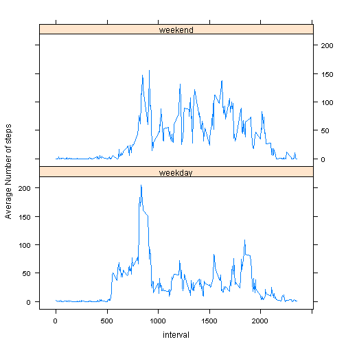

Reproducable Research Peer Assessment 1
========================================================

## Download the data 
Note: You have to change the target link from https to http to get this to work in knitr


```r
target_url <- "http://d396qusza40orc.cloudfront.net/repdata%2Fdata%2Factivity.zip"
target_localfile = "ActivityMonitoringData.zip"
if (!file.exists(target_localfile)) {
  download.file(target_url, destfile = target_localfile) 
}
```

Unzip the file to the temporary directory

```r
unzip(target_localfile, exdir="extract", overwrite=TRUE)
```

List the extracted files

```r
list.files("./extract")
```

```
## [1] "activity.csv"
```

## Loading and preprocessing the data
-Load the extracted data into R

```r
activity.csv <- read.csv("./extract/activity.csv", header = TRUE)
```

-Remove rows that contain NA

```r
activity1 <- activity.csv[complete.cases(activity.csv),]
str(activity1)
```

```
## 'data.frame':	15264 obs. of  3 variables:
##  $ steps   : int  0 0 0 0 0 0 0 0 0 0 ...
##  $ date    : Factor w/ 61 levels "2012-10-01","2012-10-02",..: 2 2 2 2 2 2 2 2 2 2 ...
##  $ interval: int  0 5 10 15 20 25 30 35 40 45 ...
```

## What is mean total number of steps taken per day?
-Use a histogram to view the number of steps taken each day, but first create an aggregrate to get the sum of steps per day


```r
histData <- aggregate(steps ~ date, data = activity1, sum)
```

and now the histogram

```r
h <- hist(histData$steps,  # Save histogram as object
          breaks = 11,  
          freq = T, #not a density graph
          col = "thistle1", 
          main = "Histogram of Activity",
          xlab = "Number of daily steps")
```

 

-Obtain the Mean and Median of the daily steps.

I did compare the mean to the summary (to reconcile, but not shown), however they were different.  The reason was the digits by default are 3, so they created different numbers.  Once I added the options command below this fixed the issue:


```r
options(digits=12)
steps <- histData$steps
mean(steps)
```

```
## [1] 10766.1886792
```

```r
median(steps)
```

```
## [1] 10765
```

## What is the average daily activity pattern?

Obtain the mean by again using aggregate, but the function being mean and by interval, not date:


```r
plotData <- aggregate(steps ~ interval, data = activity1, mean)
plot(plotData, type="l", main=" Average number of steps taken, averaged across all days")
```

 

-Which 5-minute interval, on average across all the days in the dataset, contains the maximum number of steps?

To find the maximum I will use an SQLDF command


```r
library(sqldf)
```

```
## Loading required package: gsubfn
## Loading required package: proto
## Loading required package: RSQLite
## Loading required package: DBI
## Loading required package: RSQLite.extfuns
```

```r
sqldf("select interval, max(steps) steps from plotData")
```

```
## Loading required package: tcltk
```

```
##   interval         steps
## 1      835 206.169811321
```
interval 835 has the maximum number of steps on average (206)

## Imputing missing values
Find the amount of rows that contain missing values.  As I removed them earlier this is a simple subtraction:


```r
MissingValues <- (nrow(activity.csv) - nrow(activity1))
MissingValues
```

```
## [1] 2304
```

Now to replace the NAs with a value, I've decided to use the Median of the interval, so if the NA is at interval 0, then it will be given the median steps value for interval 0.  I used data.table from this after researching and finding the following page: http://stackoverflow.com/questions/11971876/how-to-fill-na-with-median


```r
library(data.table)
DT <- data.table(activity.csv)
setkey(DT, interval)

DT[,steps := ifelse(is.na(steps), median(steps, na.rm=TRUE), steps), by=interval]
```

```
##        steps       date interval
##     1:     0 2012-10-01        0
##     2:     0 2012-10-02        0
##     3:     0 2012-10-03        0
##     4:    47 2012-10-04        0
##     5:     0 2012-10-05        0
##    ---                          
## 17564:     0 2012-11-26     2355
## 17565:     0 2012-11-27     2355
## 17566:     0 2012-11-28     2355
## 17567:     0 2012-11-29     2355
## 17568:     0 2012-11-30     2355
```

```r
DT <- DT[order(date,interval)]
head(DT)
```

```
##    steps       date interval
## 1:     0 2012-10-01        0
## 2:     0 2012-10-01        5
## 3:     0 2012-10-01       10
## 4:     0 2012-10-01       15
## 5:     0 2012-10-01       20
## 6:     0 2012-10-01       25
```

Create a histogram of the new data:

```r
NAs_replaced <- aggregate(steps ~ date, data = DT, sum)
h2 <- hist(NAs_replaced$steps,  # Save histogram as object
          breaks = 11,  # "Suggests" 11 bins
          freq = T,
          col = rgb(0,0,1,1/4), 
          main = "Histogram of Activity",
          xlab = "Number of daily steps when NAs are replaced with the interval Median")
```

 

To show the difference after the changes I've included both in the following histogram:

```r
NAs_removed <- aggregate(steps ~ date, data = activity1, sum)
NAs_replaced <- aggregate(steps ~ date, data = DT, sum)

hist(NAs_replaced$steps, col=rgb(1,0,0,0.5),breaks = 11,main = "Histogram of Activity", xlab="Variable")
hist(NAs_removed$steps, col=rgb(0,0,1,0.5), breaks = 11, add=T)
legend("topright", c("Replaced NAs", "Removed NAs"), col=c(rgb(1,0,0,0.5), rgb(0,0,1,0.5)), lwd=10)
box()
```

 

So how do these affect the Mean and Median? the new mean and medians are:

```r
NAsReplacedSteps <-aggregate(steps ~ date, data = DT, sum)
mean(NAsReplacedSteps$steps)
```

```
## [1] 9503.86885246
```

```r
median(NAsReplacedSteps$steps)
```

```
## [1] 10395
```

To compare the difference between the new figures and those we created when we removed the NAs we do a simple subtraction:

```r
mean(NAsReplacedSteps$steps) - mean(steps)
```

```
## [1] -1262.31982679
```

```r
median(NAsReplacedSteps$steps) - median(steps)
```

```
## [1] -370
```

Therefore replacing the missing values has affected the averages quite significantly

## Are there differences in activity patterns between weekdays and weekends?

Create a new factor variable in the dataset with two levels -- "weekday" and "weekend" indicating whether a given date is a weekday or weekend day, I can do this  by creating the new column via an ifelse statement:


```r
class(DT$date)
```

```
## [1] "factor"
```

```r
DT$days <- ifelse(!weekdays(as.Date(DT$date)) %in% c("Saturday", "Sunday"),
       "weekday","weekend")

head(DT)
```

```
##    steps       date interval    days
## 1:     0 2012-10-01        0 weekday
## 2:     0 2012-10-01        5 weekday
## 3:     0 2012-10-01       10 weekday
## 4:     0 2012-10-01       15 weekday
## 5:     0 2012-10-01       20 weekday
## 6:     0 2012-10-01       25 weekday
```

Make a panel plot containing a time series plot  of the 5-minute interval (x-axis) and the average number of steps taken, averaged across all weekday days or weekend days


```r
library(lattice)

DT1 <- aggregate(DT$steps, list(days = DT$days, interval = DT$interval), mean)

xyplot(x ~ interval | days, data = DT1, type = "l", layout = c(1, 2), ylab="Average Number of steps")
```

 

Interseting that the average steps do differ bewtween weekdays and weekends.   Weekends don't have that major spike and seem more spread across the intervals.
